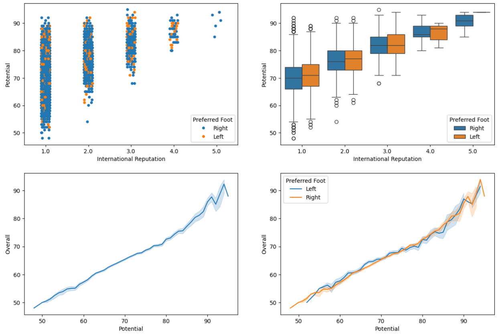

**⚽ FIFA 2019 Data Analysis Project**
📌 Layihə haqqında

Bu layihə FIFA 2019 dataset-i üzərində aparılan data analizi və vizuallaşdırma işlərini əhatə edir. Layihənin əsas məqsədi futbolçuların statistik göstəricilərini analiz edərək mənalı nəticələr əldə etmək və bu nəticələri vizual formada təqdim etməkdir.
- Oyunçuların yaş paylanması 
- Oyunçuların istifadə etdiyi ayağının qiymətə təsiri
- Sağ ayaqdan və sol ayaqdan istifadə edən oyunçuların sayı
- Ayağa görə futbolçuların ortalama dəyəri
- Beynəlxalq Reputasiya və Oyunçu Potensialı - İstifadə olunan ayaq arasındakı əlaqə
- Oyunçuların Potensialları və Gücləri arasında əlaqə
- Oyunçuların Potensialları və Gücləri-İstifadə olunan ayaq arasında

**İstifadə olunan texnologiyalar**

Python

Pandas – data emalı və analiz

NumPy – riyazi əməliyyatlar

Matplotlib – vizuallaşdırma

Seaborn – statistik qrafiklər

Jupyter Notebook

Layihə data analitika bacarıqlarının (data cleaning, data transformation, visualization, analysis) inkişaf etdirilməsi məqsədi ilə hazırlanmışdır.
